# webidl2nim
Tool to translate webidl code to Nim (js target).
## Cli
After installing you can just type:
```bash
webidl2nim
```
and translate code via cli

## Quickstart
```nim
import webidl2nim
import std/[deques, sequtils, sugar]
import pkg/npeg

let t = tokenize"""
interface Hello-Webidl {
};
"""
let c = parseCode(t).stack.toSeq

let translator {.used.} = Translator(
  settings: TranslatorSettings(
  optionalAttributePolicy: GenDeferredProcs,#UseDefaultVal,#GenDeferredProcs,
  features: {
    MethodCallSyntax, 
    NamespaceJsFieldBinding, 
    ObjConstrRequired,
    ReadonlyAttributes
  },
  exportCode: true,
  onIdent: (node: NimUNode, isDecl: bool) =>
    node
    .nep1Rename(isDecl)
    .keywordToAccQuoted()
    .makePublic
  ),
)

import "$nim"/compiler/[ast, renderer]
echo translator.translate(c).assemble(translator.imports).to(PNode)
```
Output:
```nim
type
  HelloWebidl* = ref object of JsRoot
```
## Features
#### import std lib modules that needed for definition.
```webidl
interface NumberWrapper {
  attribute bigint num;
};
```
Output:
```nim
import
  std / jsbigints

type
  NumberWrapper* = ref object of JsRoot
    num* {.importc: "num".}: JsBigInt
```
#### automatically reorder code.
```webidl
interface NumberWrapper {
  TypeFromFuture sum(short ...num);
};

typedef unsigned long type-from-future;
```
Output:
```nim
type
  TypeFromFuture* = distinct uint32
  NumberWrapper* = ref object of JsRoot
  
proc sum*(self: NumberWrapper; num: varargs[int16]): TypeFromFuture {.importc: .}
```
#### method call syntax support (UFCS)
```webidl
interface NumberWrapper {
  unsigned long long sum(short ...num);
};
```
Output (with method call syntax):
```nim
type
  NumberWrapper* = ref object of JsRoot
  
proc sum*(self: NumberWrapper; num: varargs[int16]): uint64
    {.importjs: "#.$1($2, $3)".}
```
Output (without method call syntax):
```nim
type
  NumberWrapper* = ref object of JsRoot
  
proc sum*(self: NumberWrapper; num: varargs[int16]): uint64 {.importc.}
```

## Unsupported things:
In webidl when value out of bounds of limited size types, value casting to type.
```webidl
[Exposed=Window]
interface GraphicsContext {
  undefined setColor(octet red, octet green, octet blue);
};
```
```js
var context = getGraphicsContext();
context.setColor(-1, 255, 257); // it's equals to context.setColor(255, 255, 1)
```
It removes the benefits of static typing, so it unsupported.
